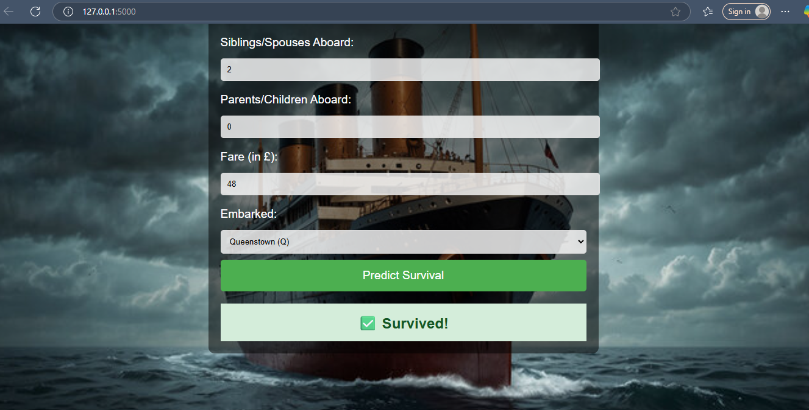

# Titanic Survival Predictor

## 🚀 Overview

This is a Flask-based web application that predicts Titanic survival based on passenger data. The app takes various features such as class, gender, age, and more to predict whether a passenger would have survived the Titanic disaster.

## 🎯 Features

- Predict survival using a trained Machine Learning model
- Interactive and animated web interface
- User input validation
- Responsive design with background image for visual appeal

## 🧠 Machine Learning Model

- **Algorithm**: Random Forest Classifier
- **Trained On**: Titanic dataset (from Kaggle)
- **Preprocessing Includes**:
  - Handling missing values
  - Feature engineering (e.g., FamilySize, IsAlone)
  - One-hot encoding for categorical variables

## 🛠️ Tech Stack

- **Frontend**: HTML5, CSS3, JavaScript
- **Backend**: Flask (Python)
- **Model Deployment**: Pickle serialization
- **Tools**: Jupyter Notebook, VS Code

## 📂 Project Structure

classification_project/
│
├── templates/
│ └── index.html # Web UI
├── static/
│ └── background.jpg # Background image
├── model/
│ └── titanic_model.pkl # Trained ML model
├── app.py # Flask app
├── test_api.py # API testing script
├── README.md # Documentation
├── requirements.txt # Python dependencies


## 📦 Installation & Running Locally

1. Clone this repository:

   ```bash
   git clone https://github.com/your-username/titanic-survival-predictor.git
   cd titanic-survival-predictor

2. Create a virtual environment (optional but recommended):

python -m venv venv
venv\Scripts\activate   # On Windows

3. Install dependencies:

pip install -r requirements.txt

4. Run the Flask app:

python titanic_api.py

5. Run the test API:

python test_api.py

6. Open your browser and visit: http://127.0.0.1:5000

👩‍💻 Developer
Name: Shilpa J Chethalen
Project Type: Personal Project (Not affiliated with any university)
Purpose: Skill development and portfolio enhancement

Screenshots





📄 License
This project is open source and free to use for learning and personal purposes.

⭐ Don’t forget to star the repository if you like it!


